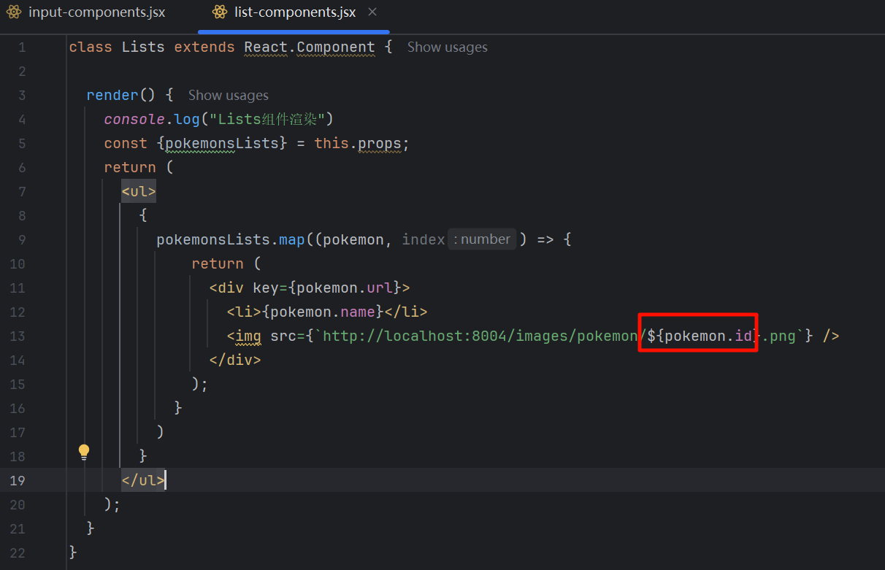
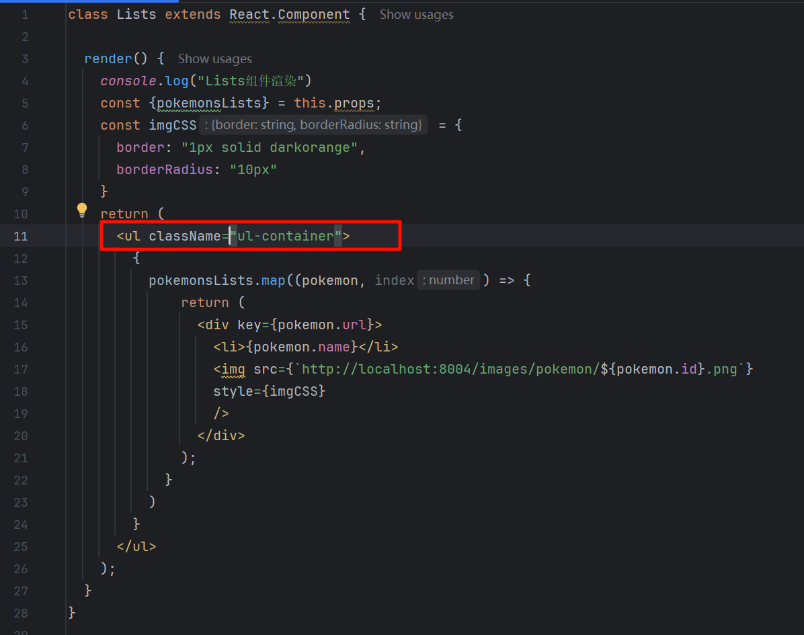

# React 入门
B站：技术蛋老师


> https://www.bilibili.com/video/BV1be411w7iF


现在的react已经变得和以前不太相同，很多刚入门的同学会觉得概念非常难啃，为了让大家理解react核心运作原理，并且顺利度过新手期，我会用一个小项目，加上和其他老师不太一样的方法，给大家讲解react。

首先我们创建一个html文件，因为react不是原生JAVASCRIPT的东西，要使用react一般会用脚手架的方式创建项目，但是我不建议新手一开始就用脚手架来入门，因此这里就用CDN来引入react代码，让我们可以使用react的功能，直接在H标签里面引入就好了，大家可以看到这里需要用到两条链接，分别是react和react dom，现在我们就可以使用react功能了。

别急，我们先想想如何设计这个应用，比方说我们的项目有搜索框和显示的列表，如果为了设置CSS样式，我们会为搜索框和列表分为两个区域，对于分区域在react里面就有另一种说法，也就是组件不过来，页面就是由不同区域组成的，为什么要加组件呢，神奇的地方就在这里了，我们可以把单独的html、CSS和js写在组件里面，如果你的应用要实现类似的功能就可以直接把组件的代码复制过去，如果你要开发其他应用也要类似的功能，也可以把组件的代码复制过去，非常方便，要知道，如果把html、CSS和js全部分为不同的文件，要实现类似的功能，就在这里复制一下，那里复制一点，改来改去，非常容易出错。

同理所有的组件都可以归属于一个根组件，就像我们写CSS的时候，时常需要用标签进行包裹一样，所以我这里就创建一个id为root的def标签，我打算用它来做跟组件，当然我们还要创建script标签来写js代码，但是现在组件并没有真正的被创建，因此我们可以用react dom的create root方法，来为指定标签创建根组件，也就是id为root的def标签，因为根组件里面没有任何内容，因此需要指定渲染的具体内容，这里就可以用到根组件的render方法，并且直接在render里面输入我们需要渲染的东西，比如我就要一个H1标签，直接写入就好了，这个时候大家可以思考一下，这段代码能执行吗，肯定是不行的，react并不是原生js的东西，我们不加引号，直接这样写，html在js里浏览器根本就不认识，因此我们需要用babel来自进行转换，也就是把用react写的代码转成原生的js，这里我们只需要加上babel的CDN，并且在script标签上加上type等于text bable，这个时候页面就可以显示出我们的内容了。

### 第01个例子

```react
<!DOCTYPE html>
<html lang="en">
  <head>
    <meta charset="UTF-8">
    <meta name="viewport" content="width=device-width, initial-scale=1">
    <link rel="shortcut icon" href="#">
    <script crossorigin src="https://unpkg.com/react@18/umd/react.development.js"></script>
    <script crossorigin src="https://unpkg.com/react-dom@18/umd/react-dom.development.js"></script>
    <script src="https://unpkg.com/@babel/standalone/babel.min.js"></script>
  </head>
  <body>
    <div id="root"></div>

    <script type="text/babel">
      const root = ReactDOM.createRoot(document.getElementById('root'));
      root.render(<h1>宝可梦</h1>);
    </script>
  </body>
</html>

```


虽然我们可以使用react，但是如果我们把所有html都写在render方法里面，就太恶心人了，还好render的方法里面是传入一个组件的，组件也是可以有名字的，比如代表整个应用的根组件，一般可以叫做API组件，搜索框组件我们可以叫做search组件，组件名字是可以自定义的，把组件写好以后，用尖括号括起来，就可以放入到render方法的参数里了，就像一个自定义的html标签一样，但很明显这个app组件还没有创建，创建组件有两种方式，类组件和函数组件，现在很多教程都不教类组件了，直接教函数组件，导致很多同学弄不懂react的核心运作原理，因此这里我会先用类组件。

但是别以为学了只是为了弄懂原理，好些公司依旧在使用类组件。

我们来创建一个app类，并且继承react component，这样我们就可以使用react组件的功能了
在这个类组件里面最核心的语法是render方法，因为我们需要告诉react，我们需要渲染什么组件，并且return出去，这里还是一样，返回刚刚的内容，页面，刷新以后，大家可以看到没有出错，这就有意思了，因为我们可以把所有组件的东西，都写在这个类里面，而不是html文件，写.js文件再写点，我需要大家思考一下，如果我需要一个输入框，可以直接在react后面用大括号，把html内容都括起来，这里有两个新手经常犯的错误，首先如果我们return出去的是一个大括号，意味着我们返回的是一个js对象，js对象可没有这样直接在里面写html的语法，因此为了让我们可以在js里这样写，html react定义了一种叫js的语法，jsx其实就是原生js语法的一种扩展，不用想的太复杂，jsx需要我们用圆括号括起来，其次jsx只能有一个根元素，也就是只能有一个爸爸，现在这里两个元素没有爸爸，或者说两个元素都是爸爸肯定是不行的，因此我们需要包裹一个外层的元素，作为爸爸查看一下页面就没有错误了。

### 第02个例子

```react
<!DOCTYPE html>
<html lang="en">
  <head>
    <meta charset="UTF-8">
    <meta name="viewport" content="width=device-width, initial-scale=1">
    <link rel="shortcut icon" href="#">
    <script crossorigin src="https://unpkg.com/react@18/umd/react.development.js"></script>
    <script crossorigin src="https://unpkg.com/react-dom@18/umd/react-dom.development.js"></script>
    <script src="https://unpkg.com/@babel/standalone/babel.min.js"></script>
  </head>
  <body>
    <div id="root"></div>

    <script type="text/babel">
      const root = ReactDOM.createRoot(document.getElementById('root'));

      class App extends React.Component {
        render() {
          return(<div>
            <h1>宝可梦</h1>
            <input type="search" placeholder="请输入宝可梦名称" />
          </div>) ;
        }
      }

      root.render(<App />);
    </script>
  </body>
</html>

```


jsx不只可以写html，当然还可以写js，比方说这里我在类的外面有一个数组，然后我就用ul和li来把数组给输出出来，在li标签里，我们只需要用大括号来接受要输出的值，这种方式也叫差值表达式，但是如果这样写是要被骂死的，有1万个数组元素该怎么办，因此我们需要对数组进行遍历，这里我们就使用map，因为还是在html里写js，因此依旧需要使用大括号来包裹，我们要执行的逻辑，每次遍历的时候创建一个li标签，并且为li标签填写数组元素内容，这里要注意，因为我没有在箭头后面写大括号，因此会直接return后面的内容。

### 第03个例子

```react
<!DOCTYPE html>
<html lang="en">
  <head>
    <meta charset="UTF-8">
    <meta name="viewport" content="width=device-width, initial-scale=1">
    <link rel="shortcut icon" href="#">
    <script crossorigin src="https://unpkg.com/react@18/umd/react.development.js"></script>
    <script crossorigin src="https://unpkg.com/react-dom@18/umd/react-dom.development.js"></script>
    <script src="https://unpkg.com/@babel/standalone/babel.min.js"></script>
  </head>
  <body>
    <div id="root"></div>

    <script type="text/babel">
      const root = ReactDOM.createRoot(document.getElementById('root'));

      const pokemons = ["皮卡丘", "杰尼龟", "小火龙"];

      class App extends React.Component {
        render() {
          return(<div>
            <h1>宝可梦</h1>
            <input type="search" placeholder="请输入宝可梦名称" />
            <ul>
              {
                pokemons.map(pokemon => <li>{pokemon}</li>)
              }
            </ul>
          </div>) ;
        }
      }

      root.render(<App />);
    </script>
  </body>
</html>

```


虽然减少了很多代码，但是大家想想这个数组的位置，这个数组原本就是这个app组件里的东西，如果写在类外面，要再复用组件就比较麻烦了，因此我们要放在类里面，又因为数组的内容在类初始化就要有了，因此要写在construct里面，因为我们已经用extends继承父类了，construct也要用super来调用父类的函数，大家思考一下，因为map里面的是回调函数，也就是说li标签是后来再加入到页面的，页面就变成动态的了，从静态变成动态就存在状态了，我们把数组的内容放在react状态里，就可以动态地进行操作，因此我们需要定义状态值，我们可以用this.state，this.state是一个对象，这个对象里我们就可以定义各种状态了，比如这里，我就可以把刚刚的数组用键值对的方式保存，这里的值就是初始化的状态值了，刚才的速度也就不需要了，相应的我们也把下面map那行加上this.state进行调用，我们的页面也就能看到遍历的列表了。

### 第04个例子

```react
<!DOCTYPE html>
<html lang="en">
  <head>
    <meta charset="UTF-8">
    <meta name="viewport" content="width=device-width, initial-scale=1">
    <link rel="shortcut icon" href="#">
    <script crossorigin src="https://unpkg.com/react@18/umd/react.development.js"></script>
    <script crossorigin src="https://unpkg.com/react-dom@18/umd/react-dom.development.js"></script>
    <script src="https://unpkg.com/@babel/standalone/babel.min.js"></script>
  </head>
  <body>
    <div id="root"></div>

    <script type="text/babel">
      const root = ReactDOM.createRoot(document.getElementById('root'));

      class App extends React.Component {
        constructor() {
          super();
          this.state = {
            pokemons: ["皮卡丘", "杰尼龟", "小火龙"],
          }
        }

        render() {
          return(<div>
            <h1>宝可梦</h1>
            <input type="search" placeholder="请输入宝可梦名称" />
            <ul>
              {
                this.state.pokemons.map(pokemon => <li>{pokemon}</li>)
              }
            </ul>
          </div>) ;
        }
      }

      root.render(<App />);
    </script>
  </body>
</html>
```


虽然代码简化了不少，不过实际的数据我们很少会这样写死，因此我打算获取API的数据，并且放到这个数组里，我们就得思考一下，什么时候把获取到的API呈现到页面里呢，一般来说我们都是想要先呈现整个页面的轮廓，再把外面获取回来的数据呈现到页面上，这样用户就不会看到，先数据后轮廓的奇怪现象了。

react提供了componentDidMount方法，这个方法可以使我们在组件挂载完毕后，在执行这个方法里的内容，因为要获取API的数据，这里就使用fetch，并且把获取到的数据转成json格式，然后我们看看控制台输出了什么东西，这里可以看到有个warning，我们等会解释，先看看获取到的数据，但还不是我们真正要的东西，我们还需要再进一步获取得到results里面的数组，很明显，我们需要用这个API的数组来代替，初始化状态里的数组，那我们可不可以直接用赋值的方式来操作呢，同时在控制台输出，看看结果如何。

```react
<!DOCTYPE html>
<html lang="en">
<head>
    <meta charset="UTF-8">
    <meta name="viewport" content="width=device-width, initial-scale=1">
    <link rel="shortcut icon" href="#">
    <script crossorigin src="https://unpkg.com/react@18/umd/react.development.js"></script>
    <script crossorigin src="https://unpkg.com/react-dom@18/umd/react-dom.development.js"></script>
    <script src="https://unpkg.com/@babel/standalone/babel.min.js"></script>
</head>
<body>
<div id="root"></div>

<script type="text/babel">
    const root = ReactDOM.createRoot(document.getElementById('root'));

    class App extends React.Component {
        constructor() {
            super();
            this.state = {
                pokemons: ["皮卡丘", "杰尼龟", "小火龙"],
            }
        }

        componentDidMount() {
            fetch('https://pokeapi.co/api/v2/pokemon?limit=10')
                .then(res => res.json())
                .then(json => {
                    this.state.pokemons = json.results;
                    console.log(this.state);
                });
        }

        render() {
            return (<div>
                <h1>宝可梦</h1>
                <input type="search" placeholder="请输入宝可梦名称"/>
                <ul>
                    {
                        this.state.pokemons.map(pokemon => <li>{pokemon}</li>)
                    }
                </ul>
            </div>);
        }
    }

    root.render(<App/>);
</script>
</body>
</html>
```


结果大家发现了this.state里面的东西改了，但是我们的页面居然没有更新，这是怎么回事，和原生js里的不是一回事，其实这里是react其中一个特点，react不会让我们的代码像以以前那样，频繁操作到，如果我们直接用赋值的方式修改对象属性，对象属性所处的内存位置还是没有改变的，我们要把这个对象属性的内存位置完全改了，最简单的就是再创建一个新的对象，还好react提供了一个distances data方法，也就是改变状态值的方法，我们可以直接在setState里面传入一个对象，并且输入我们要改变的键值对，与此同时，我们还得把li标签里的差值表达式更新一下，因为数组里面是以对象的形式存储元素的，刷新一下页面，网页内容就变得丰富起来了。

### 第05个例子

```react
<!DOCTYPE html>
<html lang="en">
<head>
    <meta charset="UTF-8">
    <meta name="viewport" content="width=device-width, initial-scale=1">
    <link rel="shortcut icon" href="#">
    <script crossorigin src="https://unpkg.com/react@18/umd/react.development.js"></script>
    <script crossorigin src="https://unpkg.com/react-dom@18/umd/react-dom.development.js"></script>
    <script src="https://unpkg.com/@babel/standalone/babel.min.js"></script>
</head>
<body>
<div id="root"></div>

<script type="text/babel">
    const root = ReactDOM.createRoot(document.getElementById('root'));

    class App extends React.Component {
        constructor() {
            super();
            this.state = {
                pokemons: ["皮卡丘", "杰尼龟", "小火龙"],
            }
        }

        componentDidMount() {
            fetch('https://pokeapi.co/api/v2/pokemon?limit=10')
                .then(res => res.json())
                .then(json => {
                    this.setState({
                        pokemons: json.results
                    });
                    console.log(this.state);
                });
        }

        render() {
            return (<div>
                <h1>宝可梦</h1>
                <input type="search" placeholder="请输入宝可梦名称"/>
                <ul>
                    {
                        this.state.pokemons.map(pokemon => <li>{pokemon.name}</li>)
                    }
                </ul>
            </div>);
        }
    }

    root.render(<App/>);
</script>
</body>
</html>
```


不过我想有同学心里可能有个疑惑，如果我的初始状态值里面有其他值，我更新了一下，那其他的不也被覆盖了吗，很简单，我们在初始状态时，这里新增一对键值对，并且在setState后面，再把state对象的内容输出就知道了，我估计有同学曾经卡在这里，我们的页面正常显示新的状态值，可是输出的却是原始的状态值，怎么回事，其实setState如果这样设置会进行回调，因此大部分情况任务队列会先执行console.log，然后再执行this.setState里的回调，这属于js基础了，具体看我那期闭包视频就好，如果不理解也没关系，因为this.setState里面可以输入两个函数作为参数，第一个函数主要用来更新状态值，第二个函数可以用来更新状态之后的操作，第二个函数会在第一个函数后执行，那我们就可以在第一个函数里直接返回，我们要更新的状态值，还是用对象的方式返回，第二个函数就输出我们的状态值，结果大家可以发现一下子解决了两个问题。

### 第06个例子

```react
<!DOCTYPE html>
<html lang="en">
<head>
    <meta charset="UTF-8">
    <meta name="viewport" content="width=device-width, initial-scale=1">
    <link rel="shortcut icon" href="#">
    <script crossorigin src="https://unpkg.com/react@18/umd/react.development.js"></script>
    <script crossorigin src="https://unpkg.com/react-dom@18/umd/react-dom.development.js"></script>
    <script src="https://unpkg.com/@babel/standalone/babel.min.js"></script>
</head>
<body>
<div id="root"></div>

<script type="text/babel">
    const root = ReactDOM.createRoot(document.getElementById('root'));

    class App extends React.Component {
        constructor() {
            super();
            this.state = {
                pokemons: ["皮卡丘", "杰尼龟", "小火龙"],
                egg: "蛋蛋老师",
            }
        }

        componentDidMount() {
            fetch('https://pokeapi.co/api/v2/pokemon?limit=10')
                .then(res => res.json())
                .then(json => {
                    this.setState(
                        () => {
                            return {pokemons: json.results};
                        },
                        () => {
                            console.log(this.state)
                        });
                    console.log(this.state);
                });
        }

        render() {
            return (<div>
                <h1>宝可梦</h1>
                <input type="search" placeholder="请输入宝可梦名称"/>
                <ul>
                    {
                        this.state.pokemons.map(pokemon => <li>{pokemon.name}</li>)
                    }
                </ul>
            </div>);
        }
    }

    root.render(<App/>);
</script>
</body>
</html>

```


首先更新后的状态值被正常输出到控制台，其次我们并没有在更新的时候，把原来的状态值给覆盖掉，这里其实叫做浅合并，把两个对象的键值对来一个合并，但是只修改需要修改的，不用修改的就不动它。

目前我们的控制台还剩下一个报错问题，其实这里说的是我们遍历的时候，应该为每个子项目增加一个唯一的key属性，为什么要这么麻烦呢，其实对性能有大大的好处，如果我们后期对列表中其中一个子项目，进行动态更新，react就可以根据这唯一的key属性进行定位更新，而不是把所有的DOM都更新一遍，还好我们的子元素里有个URL，可以作为唯一的key，这里就以这个URL为key添加到纸项目上，可是当我们刷新页面的时候，控制台还是有报错信息，按道理应该不会出错的，也是符合官方文档的要求，把key设置好的呀，为了查看是不是key值在导弹，我们不妨用map遍历时候产生的index参数作为key，因为每个元素的index都不一样，我们暂且拿来使用。

### 第07个例子

```react	
<!DOCTYPE html>
<html lang="en">
<head>
    <meta charset="UTF-8">
    <meta name="viewport" content="width=device-width, initial-scale=1">
    <link rel="shortcut icon" href="#">
    <script crossorigin src="https://unpkg.com/react@18/umd/react.development.js"></script>
    <script crossorigin src="https://unpkg.com/react-dom@18/umd/react-dom.development.js"></script>
    <script src="https://unpkg.com/@babel/standalone/babel.min.js"></script>
</head>
<body>
<div id="root"></div>

<script type="text/babel">
    const root = ReactDOM.createRoot(document.getElementById('root'));

    class App extends React.Component {
        constructor() {
            super();
            this.state = {
                pokemons: ["皮卡丘", "杰尼龟", "小火龙"],
                egg: "蛋蛋老师",
            }
        }

        componentDidMount() {
            fetch('https://pokeapi.co/api/v2/pokemon?limit=10')
                .then(res => res.json())
                .then(json => {
                    this.setState(
                        () => {
                            return {pokemons: json.results};
                        },
                        () => {
                            console.log(this.state)
                        });
                    console.log(this.state);
                });
        }

        render() {
            return (<div>
                <h1>宝可梦</h1>
                <input type="search" placeholder="请输入宝可梦名称"/>
                <ul>
                    {
                        this.state.pokemons.map((pokemon, index) => <li key={index}>{pokemon.name}</li>)
                    }
                </ul>
            </div>);
        }
    }

    root.render(<App/>);
</script>
</body>
</html>
```


大家可以发现控制台没有报错了，证明我们刚刚的key值是有问题的，但是我们确实又能够把状态值输出出来，这里就涉及到较底层的概念了，也就是代码的执行顺序，这里我分别为constructor，componentDidMount和render方法添加输出内容，来查看执行的顺序，并且把key改为我们原先出错的那个值，大家看一看输出的顺序，首先是构造函数，
因为里面是初始化的内容，接着是渲染，注意并没有从上往下，这样执行初始化后就直接进行渲染了，接着再执行组件挂载后的内容，最后再次进行渲染，这其实是比较简单，也比较核心的react生命周期。

### 第08个例子

```react
<!DOCTYPE html>
<html lang="en">
<head>
    <meta charset="UTF-8">
    <meta name="viewport" content="width=device-width, initial-scale=1">
    <link rel="shortcut icon" href="#">
    <script crossorigin src="https://unpkg.com/react@18/umd/react.development.js"></script>
    <script crossorigin src="https://unpkg.com/react-dom@18/umd/react-dom.development.js"></script>
    <script src="https://unpkg.com/@babel/standalone/babel.min.js"></script>
</head>
<body>
<div id="root"></div>

<script type="text/babel">
    const root = ReactDOM.createRoot(document.getElementById('root'));

    class App extends React.Component {
        constructor() {
            console.log("构造函数被调用");

            super();
            this.state = {
                pokemons: ["皮卡丘", "杰尼龟", "小火龙"],
                egg: "蛋蛋老师",
            }
        }

        componentDidMount() {
            console.log("组件挂载完成");

            fetch('https://pokeapi.co/api/v2/pokemon?limit=10')
                .then(res => res.json())
                .then(json => {
                    this.setState(
                        () => {
                            return {pokemons: json.results};
                        },
                        () => {
                            console.log(this.state)
                        });
                    console.log(this.state);
                });
        }

        render() {
            console.log("渲染函数被调用");

            return (<div>
                <h1>宝可梦</h1>
                <input type="search" placeholder="请输入宝可梦名称"/>
                <ul>
                    {
                        this.state.pokemons.map((pokemon, index) => <li key={pokemon.url}>{pokemon.name}</li>)
                    }
                </ul>
            </div>);
        }
    }

    root.render(<App/>);
</script>
</body>
</html>

```


在这里我们也得到了问题的答案，我们第一次渲染的时候，这里的key就被设置了，而此时是数组是由字符串组成的，而不是由对象组成的，根本就获取不到对应的值，根本就没有POKEMAN点URL属性值，所以就会提前进行报错，在执行下一步组件已挂载之前就给你报错，即使后面能获取到新的key，这个错误也是已经存在了，千万不要觉得这个流程没什么，很多人不理解react就是没理解基本的生命周期。

我们要解决这里的问题也很简单，直接把初始的数组设置为空就好。

### 第09个例子

```react
<!DOCTYPE html>
<html lang="en">
<head>
    <meta charset="UTF-8">
    <meta name="viewport" content="width=device-width, initial-scale=1">
    <link rel="shortcut icon" href="#">
    <script crossorigin src="https://unpkg.com/react@18/umd/react.development.js"></script>
    <script crossorigin src="https://unpkg.com/react-dom@18/umd/react-dom.development.js"></script>
    <script src="https://unpkg.com/@babel/standalone/babel.min.js"></script>
</head>
<body>
<div id="root"></div>

<script type="text/babel">
    const root = ReactDOM.createRoot(document.getElementById('root'));

    class App extends React.Component {
        constructor() {
            console.log("构造函数被调用");

            super();
            this.state = {
                pokemons: [],
                egg: "蛋蛋老师",
            }
        }

        componentDidMount() {
            console.log("组件挂载完成");

            fetch('https://pokeapi.co/api/v2/pokemon?limit=10')
                .then(res => res.json())
                .then(json => {
                    this.setState(
                        () => {
                            return {pokemons: json.results};
                        },
                        () => {
                            console.log(this.state)
                        });
                    console.log(this.state);
                });
        }

        render() {
            console.log("渲染函数被调用");

            return (<div>
                <h1>宝可梦</h1>
                <input type="search" placeholder="请输入宝可梦名称"/>
                <ul>
                    {
                        this.state.pokemons.map(pokemon => <li key={pokemon.url}>{pokemon.name}</li>)
                    }
                </ul>
            </div>);
        }
    }

    root.render(<App/>);
</script>
</body>
</html>

```


所以我们在开始设计应用的时候，要把这些因素得考虑清楚，除了要考虑这些问题以外，我们还有个重要的问题，现在的代码越来越多，虽然说jsx让我们可以在js上写html，但是我们把所有js写在html文件上也是不对劲的，因此我们需要把js全部挪出来，这里就创建一个src文件夹，在里面新增一个index.js，并且把所有的js代码都剪切过去，移动完js代码以后，我们记得在html里的标签上注明要引用的js文件，这个时候，如果你是直接打开html文件的方式来预览的话，会遇到跨域问题，可以用vscode live server来打开网页文件，或者用HTTP server这样的工具来打开网页。

没问题的话，回到js代码这里，这里有两行代码，我很不爽，就是最开头的create root和最后的random，因为目前都不用去操作了，浪费屏幕空间，因此我打算把整个API组件给拆出来。

这里创建一个app.js文件，也是放在src文件夹里面，然后我们把整个类组件放到app.js里面，完成了以后，我们把App.js引入到html文档里面，注意是先引用App.js组件文件，再引用index.js，原本这里应该用import和export来展示的，但是为了降低教程难度，把重点放在react核心里面，就以这种原始的方式演示给大家看，大家抓住重点就好，现在的代码分开以后，我们更能集中精力进行开发了

 

接着我要实现一个功能，就是输入框输入内容的时候，可以自动过滤底下的列表，那我们肯定要获取到输入框的内容对吧，因此我们需要有监听输入框的能力，原生的js用的是事件处理器，react也有事件处理器，语法稍微有一点点不一样，但是非常像，比如当输入框有变动的时候，我们就可以用onChange来进行监听，并且在理里面的函数输入我们要执行的内容，这里要注意事件名是以小驼峰来命名的，也就是小写大写，这样其实事件切的逻辑要先用大括号括起来，函数里面也是有event，我们先打印event，让大家回忆一下，如果我们往输入框输入一个B，我们就可以看到event的输出内容有原生js基础的，看到这些应该很熟悉。


这个event里有个target属性，target里面的value值就是输入框的内容了，这正是我们要获取的内容了。

如果用户不断输入或者删减，检索的列表就会随之变动，这里就存在状态，我们应该把输入框的值保存起来，因此我们需要在初始状态值里先进行提前定义，接着我们要更新这个searching状态值，只需要在输入的时候进行setState就行了，操作和刚才一样，也是来一个浅合并，合并后我们查看更新后的值，大家可以看到，当我们输入的时候，状态值也随之变动，和输入框里的是一致的。

### 第10个例子

```javascript
class App extends React.Component {
    constructor() {
        console.log("构造函数被调用");

        super();
        this.state = {
            pokemons: [],
            egg: "蛋蛋老师",
            searching: "",
        }
    }

    componentDidMount() {
        console.log("组件挂载完成");

        fetch('https://pokeapi.co/api/v2/pokemon?limit=10')
            .then(res => res.json())
            .then(json => {
                this.setState(
                    () => {
                        return {pokemons: json.results};
                    },
                    () => {
                        console.log(this.state)
                    });
                console.log(this.state);
            });
    }

    render() {
        console.log("渲染函数被调用");

        return (<div>
            <h1>宝可梦</h1>
            <input type="search" placeholder="请输入宝可梦名称" onChange={event => {
                this.setState(
                    () => {
                        return {searching: event.target.value};
                    },
                        () => {
                            console.log(this.state.searching);
                        }
                );
            }}/>
            <ul>
                {
                    this.state.pokemons.map(pokemon => <li key={pokemon.url}>{pokemon.name}</li>)
                }
            </ul>
        </div>);
    }
}
```


但是如果把这么多内容的函数写在html标签里面，我们是很很难轻松判断网页结构的，
因此这里就设置一个类方法，并且把onChange里的函数复制过去，我们就可以删除掉html标签里的逻辑了，这里特别要注意调用类方法的时候要加上this。

### 第11个例子

```js
onChangerHandler = (event) => {
    this.setState(
        () => {
            return {searching: event.target.value};
        },
        () => {
            console.log(this.state);
        }
    )
}

render() {
    console.log("渲染函数被调用");

    return (<div>
            <h1>宝可梦</h1>
            <input type="search" placeholder="请输入宝可梦名称" onChange={ this.onChangerHandler }/>
<ul>
        {
        this.state.pokemons.map(pokemon => <li key={pokemon.url}>{pokemon.name}</li>)
}
    </ul>
</div>);
}
```


接下来我们就要根据输入的内容来更新列表了，但是我们不能对原来的数组数据进行更改，应该创建一个过滤后的数组，而且这个过滤后的数组也是有状态的，因此我再创建一个状态值，这个过滤数组的初始值，需要和初始document状态值一致，因此我还需要在refresh的时候同时更新这个值，然后我们再把ul标签的逻辑更改为过滤数组，但是问题来了，我应该在哪个位置更新这个过滤数组呢，一定要想清楚，刚刚讲的生命周期在下决定，如果想不明白，我们可以用排除法，首先构造函数里面已经有初始值了，所以肯定不是在构造函数里面更新过滤数组，那能不能在组件与挂载后更新数组呢，也不好，因为组件挂载后，我们初次需要获取的是原始的数据，而不是过滤后的数据，那我们只能在渲染里面更新数组了，更不好，如果直接在render方法里面直接使用test，会容易造成死循环，简单想想就知道了，我们又要react进行渲染，渲染的时候又要改变状态值，状态值修改了又会触发渲染，这让react怎么办才好呢，因此我们需要在有事件的时候才更新，这个过滤数组，直接在onChangeHandler，先创建一个临时的变量，然后我们对原数组进行过滤，如果输入的内容匹配得了，那我们就返回这个临时变量，最后我们进行setState的时候，就只需要更新过滤数组了，过滤数组才是我们输出的内容，我们暂时也不需要searching这个状态值的，所以就可以删除掉了，这个时候我们输入内容并且删除内容的时候，下面列表就会自动更新了，当然实际中应该考虑大小写时间问题，这个应用就不考虑大小写问题了。

### 第12个例子

```react
class App extends React.Component {
    constructor() {
        console.log("构造函数被调用");

        super();
        this.state = {
            pokemons: [],
            searching: "",
            filteredPokemons: [], // 搜索结果
        }
    }

    componentDidMount() {
        console.log("组件挂载完成");

        fetch('https://pokeapi.co/api/v2/pokemon?limit=151')
            .then(res => res.json())
            .then(json => {
                this.setState(
                    () => {
                        return {
                            pokemons: json.results,
                            filteredPokemons: json.results
                        };
                    },
                    () => {
                        // console.log(this.state)
                    });
            });
    }

    onChangerHandler = (event) => {
        const filteredPokemons = this.state.pokemons.filter(
            pokemon => {return pokemon.name.toLowerCase().includes(event.target.value.toLowerCase()) }
        );

        this.setState(
            () => {
                return {filteredPokemons: filteredPokemons}
            },
            () => {
                console.log(this.state);
            }
        )
    }

    render() {
        console.log("渲染函数被调用");

        return (<div>
            <h1>宝可梦</h1>
            <input type="search" placeholder="请输入宝可梦名称" onChange={ this.onChangerHandler }/>
            <ul>
                {
                    this.state.filteredPokemons.map(pokemon => <li key={pokemon.url}>{pokemon.name}</li>)
                }
            </ul>
        </div>);
    }
}
```


现在我们的代码又突然变得多起来了，我得再来拆组件，让项目结构更加清晰才行，目前比较需要猜出来的是这个列表，因为在结构里面写逻辑会让我们结构不直观，这里就在src文件夹里，创建一个components文件夹，这个文件夹可以用来存放可复用的组件，在components文件夹里，为了分清楚不同的组件，我再创建一个list文件夹来存放列表组件，最后就可以创建我们的组件文件了，这里就命名为list-component.jsx没错，我们是可以用jsx后缀来存放组件的，当然这里用js后缀也是没错的，这里主要是给大家知道可以这么命名，而且也更容易区分可复用组件，接着还是创建一个类组件，并且把基本的结构先写出来，然后还是要记得在html文件里面插入组件，因为我们没有使用import，现在我们回到app.js，就可以把URL里的内容做一个剪切，并且用标签的形式写入我们的类组件，然后把剪切的内容再粘贴到类组件里面。

现在大家认真看看类组件这样写能运行吗，这里有两个新手经常会犯的错误，首先我们大括号执行的逻辑，会返回多个同级的li标签，前面说过是不行的，我们必须要进行包裹返回，同属于一个负元素的组件，比较简单的操作，就是把app.js的ul标签也复制过来作为包裹，然后把原来的app.js的ul标签给删除掉，第二个问题，类组件是没有自己的状态值的，因此这里用this是调用不了任何东西的，这个状态值是从app.js里面拿回来的，因此我们要想办法从父组件往子组件里传东西，还好组件有个属性props，也就是properties的缩写，这里在子组件渲染的时候打印给大家看看，并且暂时把逻辑给注释掉，大家可以看到控制台里面类组件渲染后，果然可以打印一个对象出来，只是现在这个对象里面没有东西，因为我们根本没有往组件里面传东西，当然是为空的，传值很简单，就像给html添加属性一样，比如我要给子组件传入一个叫pokemon's list的属性，这个属性的值就用我们过滤后的数组，这个时候我们可以看到控制台，这个对象有东西了，而且是随着状态值的更新而更新的，那就好办了，我们不妨把这个props里，我们需要的属性先取出来，并且保存为变量，然后再用这个变量进行遍历就好了，我们可以看到页面一就可以显示出来，这个组件就成功被拆出来了。

 


虽然我们的结构看起来比较清晰了，但是如果我们要复用这个输入框也是不方便的，因此我打算把输入框也拆出来，首先创建一个input文件夹，再在里面创建一个input-component.js作为组件文件，实际上组件名字不加component也没关系的，如果为了检索加上component会更清晰一些。

还是一样，我们先把类组件基本的东西给写一下，然后在html里面引入文件，最后回到app.js里面把组件标签写出来，这次的input标签并不像列表那样有很多东西，主要就是属性，也就是这里的onChange里的值需要传进来，那我们就可以直接给子组件传入一个叫onChangeHandler的属性，属性值就调用父类的方法就好，还是一样，先另存这个变量属性，然后传进去就好了，我们测试一下页面的功能，发现依旧可以使用证明拆组件成功了。

### 第13个例子

 


## 增加图片

现在我想为每个列表添加对应的图片，先给大家看看我要获取的图片，当我改变数字的时候，图片也相应地发生变化，不过因为某些原因，大家可能访问不了这个图片地址，如果实在访问不了，用其他图片代替练习也是一样的，现在我就可以在卖遍历的时候，把这个图片也加进去，这个时候我就需要用到map，遍历时候的index还是一样，return的时候只能是一个负元素，因此我就用def进行包裹，接着把li和image标签放在同级，并且用src属性引入我们的图片，因为我要操作图片地址需要用到js逻辑，因此这里需要先用大括号，再用模板字面量，又因为序号是从零开始的，但是图片是从一开始的，因此这里要index加一，还有一点要注意，因为我们实际上即遍历产生li标签，也遍历产生image标签，因此两个标签都需要加上key属性，方便react提高性能，当然我们也可以直接为负元素，div标签直接添加key，这样也是不会报错的，再看看我们页面的时候，图片就显示出来了。

### 第14个例子

```js
class Lists extends React.Component {

  render() {
    console.log("Lists组件渲染")
    const {pokemonsLists} = this.props;
    return (
      <ul>
        {
          pokemonsLists.map((pokemon, index) => {
              return (
                <div key={pokemon.url}>
                  <li>{pokemon.name}</li>
                  
                </div>
              );
            }
          )
        }
      </ul>
    );
  }
}
```


但是如果你仔细看这里会有个问题，好像不管我们检索哪个字符的时候，第一张图片还是原封不动，在那里肯定是不太对的，其实你们以后实战开发也可能会遇到这个问题，大家认真看一下我们的input组件里面，每次便秘的时候是根据index来遍历的，如果我们过滤后的数组只有三个元素，我们的index也是从0~2，而不是2~4或者5~7，我们状态值并没有和这个index有什么关系，要解决这个问题有很多方法。

比如说我们就可以在组件挂载后，获取API数据的时候，为每个元素对象增加一个属性，只需要用map遍历，并且用map的index作为属性值就好了，这个时候大家可以看到挂载后，每个元素就多了一个属性了，接着我们只需要回到input组件里面，因为props接收过来的是过滤后的数组，把模板式变量里的index加一改为pokemon.id就好了，因为我们前面已经加了1，这里就不用加1了，而且当前map的index参数我们也不需要用到了，现在我们再测试一下，就知道没问题了，图片也是显示正确的了。

### 第15个例子




## CSS

应用的基本功能已经完成了，但是目前根本就没有添加任何样式，如果我们要在GX上写样式也是没问题的，但是我们不能像原神那样写样式，比如直接这样写style是会出错的，因为在jsx里style的值需要传入一个对象，又因为在js里的逻辑需要用大括号扩起来，所以这里需要用到两个大括号，竟然是对象，就用键值对的形式来写style，接收一个对象，我们索性另外保存一个对象，并且为这个对象添加多个CSS键值，对最后再应用到style也是可以的，这样我们就不用写两个大括号了，但是实际中我们会有多个组件样式，文件样式文件里一般会设置很多class，要在js里使用到这些class，我们需要用到class name，比方说我们打算使用名为ul container的class，我们可以直接用引号围起来，接着新创建一个list style点CSS文件，并且在里面填写我们需要的样式，如果是用脚手架来创建项目，一般都会单独引入到各个组件里面，这里就直接引入到html的head标签里面，这个时候如果我们刷新页面就能看到样式了，当然CSS要讲还有非常多注意事项，我们入门主要核心还是在react逻辑上。

### 第16个例子


  




## 函数式

虽然我们可以用类创建组件了，但是用函数创建组件也是必须掌握的技能，而且如果你能把当前应用转成函数组件，那你对react的核心就有一个字的掌握，现在就来把每个文件都检查一遍，首先index.js就不用动了，这里我们只是直接使用组件而已，可以看看app.js，我们先把类组件的东西全部注释掉，并且创建一个函数，组件的基本结构其实就是一个函数，然后里面进行return，这里面没有什么render方法，我们需要渲染什么，直接在return里面写就好了，所以我们把类组件的render方法里的return内容，复制过来就好，接着我们的类方法，就直接在app函数组件里创建一个函数就好了，也是一样，直接复制过来，并且做变量声明就好了，但是很明显这个事件处理函数是不能用的，因为这里是函数组件，不是类组件，这里的this是会出错的，因此下一步我们要好好考虑如何设置状态值，因为函数组件没有构造函数，因此react提供了useState函数来初始化状态值，这个useState函数创建的时候，我们可以用解构赋值的形式命名两个变量，第一个是状态值，第二个是设置状态值的方法，这里我们打印一下结果，让大家有个初步的概念，大家可以看到打印了空数组，因为我们初始化就是空数组，其他报错信息我们先不管，等会来解决。

那么同理我们还可以设置多个状态值，比如过滤的数组，我们也需要设置一下，既然有了初始值以后，我们先修改一下下面调用的状态值，首先我们不用this.state这样来调用了，直接像正常变量那样进行使用，其次我们在修改状态值的时候，直接用use state设置的第二个值，并且传入新的值就可以了，接下来我们把下面的this也给去掉，像正常调用就好了，这样下来起码我们的页面是没有报错的.

有了初始状态时，我们还是一样需要用API的数据了，但是函数组件里面并没有什么，componentDidMount方法，于是我只好灰头土脸的把fetch放在初始状态时，下面执行，当然我们记得用函数组件的方式更新状态值，但是在保存文件之前，我们先在fetch的前后做两个控制台输出，如果此时我们保存文件，会发现电脑发出的噪音越来越小，如果查看控制台，我们会发现，刚刚两行的console.log 都在不断执行，也就是说我们不断的进行fetch操作，怎么会呢，如果react入门入了一点点就去做项目，是完全找不到北的。

函数组件和类组件虽然很不同，但是依旧是当状态值更新的时候，才会去执行组件里的内容，函数组件不同的是，函数组件会把组件里的代码，从上到下再执行一次，因为fetch到的内容，是会把状态值的内容给改写的，因此改了以后又执行函数组件的内容，又fetch又改写，形成了死循环，换句话说，fetch过来的数据对原本的app函数是有副作用的，并不是爱函数能够完全掌握得了的，对于有副作用的东西，react提供了useEffect函数来处理fetch API，接收两个参数，第一个参数就是我们要执行什么内容的函数，那我们就直接把fetch的内容放在这个函数里面，接着我们要思考一个问题，我们的fetch究竟什么时候第一次执行，什么时候再执行呢，因此就需要useEffect的第二个参数了，第二个参数是一个数组，第二个参数让我们决定什么时候再次执行，第一个参数里的内容，如果我们把数组设置为空，表示我们只需要执行一次以后，并没有什么条件可以让这个fetch再次执行，这样正合我们的意，而且此时我们再次查看控制台的时候，死循环就消失了，我们也不需要刚才的那两个console了。

app.js改造完成后，我们来到类组件，这里还是一样，我们先直接创建一个类似函数组件，并且把需要渲染的内容放入return里面，但是因为这里涉及到从父组件传值到子组件，也就是props，实际上这个props就是创建函数组件的一个参数，如果我们把它输出到控制台是可以看到内容的，因此我们还是可以直接用解构赋值的方式，获取属性值，只不过我们不需要用D而已，另外我们把前面设置好的CSS对象也一起定义了，这个时候我们的控制台就不会报错了，但实际上因为本来就是参数，我们可以直接在定义函数的时候，就进行解构赋值，这样可以少写点代码，最后我们来到input组件，把前面学到的内容都用到这里，简单做一下修改就OK了，这个时候我们测试一下应用的功能还是正常的，当然这个应用还有很多可以完善的地方，重要的是这个项目让你成功入门react了。

### 第17个例子


